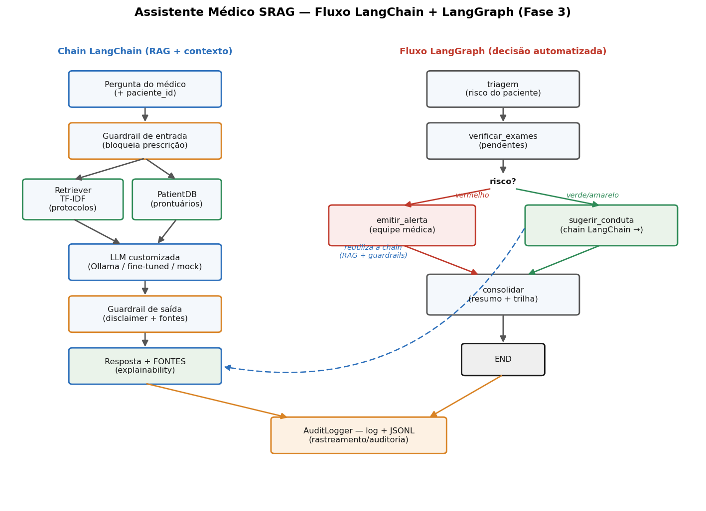

# Relatório Técnico — Tech Challenge Fase 3
## Assistente Médico com Fine-tuning de LLM + LangChain/LangGraph
### FIAP Pós-Tech — Machine Learning Engineering

---

## 1. Introdução

Após a classificação de desfecho clínico (Fase 1) e a otimização de modelos com
Algoritmos Genéticos e uma LLM explicativa (Fase 2), a Fase 3 dá ao "hospital"
um **assistente virtual médico**: um sistema que responde dúvidas clínicas,
sugere condutas com base nos **protocolos internos**, consulta **prontuários**
estruturados e coordena um **fluxo de decisão automatizado e seguro**.

Mantivemos o domínio das fases anteriores — **SRAG** (Síndrome Respiratória
Aguda Grave) — para que o projeto permaneça coeso. Todos os dados são
**sintéticos e anonimizados**; nenhuma informação real de paciente é utilizada.

O sistema atende aos quatro requisitos do enunciado: (1) fine-tuning com dados
médicos internos; (2) assistente com LangChain integrando LLM + base
estruturada + contexto do paciente; (3) segurança, auditoria e explainability;
(4) código modular com README.

---

## 2. Arquitetura geral

```
data/knowledge_base/            (dados sintéticos anonimizados)
  ├── protocolos/*.md           → fonte de verdade (RAG)
  ├── faq_medicos.jsonl         → perguntas frequentes (fine-tuning + avaliação)
  ├── laudos_modelos.jsonl      → modelos de laudo/receita/procedimento
  └── prontuarios.json          → base estruturada consultada pelo assistente

src/assistant/
  ├── config.py                 → caminhos e flags centrais
  ├── finetuning/               → data_prep, dataset_builder, train, evaluate
  ├── knowledge/                → retriever (RAG TF-IDF) + patient_db
  ├── safety/                   → guardrails + audit_log
  ├── chains/                   → llm_backend (LangChain) + medical_assistant + graph (LangGraph)
  └── cli.py                    → interface de linha de comando
```

O diagrama do fluxo LangChain/LangGraph está em
`results/figures/fluxo_langchain.png` (seção 5).

---

## 3. Fine-tuning da LLM com dados médicos internos (Requisito 1)

### 3.1 Fontes de dados e dataset de instrução

O dataset de *instruction tuning* combina, na **abordagem híbrida**, os dados
internos do hospital (SRAG, em PT-BR) com os dois datasets públicos sugeridos no
enunciado (PubMedQA e MedQuAD, em inglês), todos convertidos ao mesmo formato
`{system, prompt, response, origem, fonte, idioma}`:

| Origem | Como vira exemplo | Idioma | Qtd |
|--------|-------------------|--------|-----|
| FAQ de médicos (hospital) | pergunta → resposta (com fonte) | PT | 10 |
| Protocolos internos (hospital) | "O que o protocolo X orienta sobre <seção>?" → corpo | PT | 14 |
| Modelos de laudo/receita/procedimento | instrução → modelo do documento | PT | 3 |
| **PubMedQA** (Jin et al., 2019) | questão de pesquisa → veredito + resposta longa | EN | 250 |
| **MedQuAD** (Ben Abacha & Demner-Fushman, 2019) | pergunta de saúde do NIH → resposta | EN | 350 |

**Total: 627 exemplos.** Os dados do hospital atendem ao requisito literal
("dados próprios do hospital"); PubMedQA e MedQuAD atendem à sugestão de datasets
e ampliam a cobertura clínica geral.

**Sobre os datasets sugeridos:**
- **PubMedQA** — subconjunto rotulado (`ori_pqal.json`, 1.000 QAs de pesquisa com
  veredito sim/não/talvez + resposta longa). Licença MIT. Usamos uma fatia curada.
- **MedQuAD** — QAs de 12 sites do NIH. Usamos os **9 subconjuntos que mantêm as
  respostas**; excluímos 3 (ADAM, MedlinePlus Drugs e Herbs) cujas respostas foram
  removidas por copyright do MedlinePlus. Licença CC BY 4.0.

Citações e licenças completas em `data/knowledge_base/external/CITATIONS.md`. Os
dados brutos são baixados por `scripts/fetch_datasets.py`; fatias curadas ficam
versionadas para rodar offline. A anonimização e a curadoria (seção 3.2) são
aplicadas a todas as fontes.

### 3.2 Preprocessing, anonimização e curadoria

Antes de qualquer treino, `data_prep.py` aplica:

- **Anonimização de PII** por regex: CPF, cartão SUS (CNS), telefone, e-mail,
  datas, RG e nomes rotulados são substituídos por marcadores genéricos
  (`[CPF]`, `[EMAIL]`…). A função é **idempotente**.
- **Normalização**: colapso de espaços/quebras e `NFC`.
- **Curadoria**: remoção de respostas curtas/vazias e **deduplicação** por
  (prompt, resposta).

Embora os dados já sejam sintéticos, a anonimização é real e aplicável a dados
de produção — é onde entraria o pipeline de conformidade (LGPD) do hospital.

### 3.3 Estratégia de treino: LoRA/PEFT (real) + modo demo

Seguindo a filosofia da Fase 2 (backend Ollama ↔ mock), o `train.py` tem dois modos:

- **`real`** — fine-tuning por **LoRA/PEFT** (`transformers` + `peft`) sobre um
  modelo-base causal do Hugging Face (LLaMA/Falcon/Mistral; padrão
  `meta-llama/Llama-3.2-1B-Instruct`). Requer GPU e download do modelo. É o
  caminho de produção; o código está completo em `treinar_real()`.
- **`demo`** (padrão) — executa **todo o pipeline de dados real** e um **laço de
  treinamento simulado** que consome o dataset e produz artefatos reais: curva
  de perda, `train_metrics.json` e o manifesto do adapter. Roda em qualquer
  máquina, sem GPU nem rede, garantindo que o avaliador reproduza a demonstração.

> **Decisão explícita:** o ambiente de avaliação não tem GPU nem acesso ao
> modelo-base. Por isso a demo usa o modo simulado, exatamente como a Fase 2
> usa o backend `mock` quando o Ollama não está disponível. O código de
> fine-tuning real está presente e comentado, pronto para rodar em GPU.

### 3.4 Resultado do fine-tuning (modo demo)

Configuração: 3 épocas, LoRA r=16, α=32, 27 exemplos. A perda simulada converge
de forma realista:

| Métrica | Valor |
|---------|-------|
| Perda inicial | ~1.13 |
| Perda final | ~0.25 |
| Passos registrados | 15 |

Curva: `results/figures/finetuning_loss.png`.

---

## 4. Assistente médico com LangChain (Requisito 2)

### 4.1 Integração da LLM customizada

`CustomMedicalLLM` (em `chains/llm_backend.py`) adapta o cliente da Fase 2 à
interface `LLM` do LangChain. Isso **desacopla** a chain do backend: hoje
demonstramos com Ollama/mock; em produção, o mesmo wrapper serve a LLM
fine-tuned (apontando o Ollama para o modelo com o adapter LoRA, ou trocando por
um endpoint HF). No modo demonstração, um mock **extrativo** gera respostas
ancoradas no contexto recuperado — coerente e offline.

### 4.2 Chain principal (RAG + contexto do paciente)

`MedicalAssistant.responder()` executa:

1. **Guardrail de entrada** — bloqueia pedidos de prescrição/dose direta.
2. **Retriever (RAG)** — recupera trechos por TF-IDF e **retorna a fonte**. A
   base é híbrida: **protocolos SRAG (PT-BR)** como referência primária do
   hospital + **MedQuAD (EN)** como base de referência complementar. Uma pergunta
   sobre SRAG recupera o protocolo interno; uma pergunta clínica geral recupera a
   entrada do MedQuAD — sempre citando a origem (`PROT-SRAG-0x` ou `MedQuAD:<fonte>`).
3. **PatientDB** — se informado um `paciente_id`, injeta o **resumo clínico**
   (SpO2, FR, comorbidades, exames pendentes) — contextualização com dados
   atualizados do paciente.
4. **PromptTemplate → LLM** — resposta fundamentada apenas no contexto.
5. **Guardrail de saída** — anexa o aviso de validação humana e as fontes.

A saída é um objeto estruturado (`RespostaAssistente`) com resposta, fontes,
paciente e backend — base para explainability e auditoria.

### 4.3 Consulta à base estruturada

`PatientDB` lê `prontuarios.json` (40 pacientes sintéticos, IDs `PAC-XXXX`) e
oferece consultas determinísticas: `get`, `exames_pendentes`, `resumo_clinico`.
Nada é inventado pela LLM — os fatos do paciente vêm sempre da base.

---

## 5. Fluxo de decisão automatizado com LangGraph

O `FluxoAtendimento` (`chains/graph.py`) implementa o cenário do enunciado — "ao
receber informações de um paciente, acionar etapas como verificar exames,
sugerir tratamentos e emitir alertas" — como um `StateGraph`:

```
triagem → verificar_exames → (risco?) ┬── vermelho → emitir_alerta ┐
                                       └── verde/amarelo → sugerir_conduta ┘ → consolidar → END
```

- **triagem** — carrega o prontuário e a classificação de risco.
- **verificar_exames** — lista exames pendentes.
- **roteamento condicional** por risco: **vermelho** aciona `emitir_alerta`
  (equipe de resposta rápida); demais seguem para `sugerir_conduta`.
- **sugerir_conduta / emitir_alerta** — reutilizam a chain LangChain (RAG +
  guardrails).
- **consolidar** — monta o resumo final e a **trilha** do fluxo.

Cada nó registra um `AuditEvent`, tornando todo o fluxo auditável.

**Diagrama:** 

---

## 6. Segurança, auditoria e explainability (Requisito 3)

### 6.1 Limites de atuação (guardrails)

- **Entrada:** `checar_entrada()` detecta pedidos de prescrição/dose/posologia
  direta e os bloqueia — o assistente responde com o resumo do protocolo
  (sem números de dose), nunca com uma prescrição.
- **Saída:** `sanitizar_saida()` garante, de forma idempotente, o aviso: *"Toda
  conduta, prescrição e dose exige validação e assinatura do médico
  responsável."*

### 6.2 Logging e auditoria

`AuditLogger` grava cada interação em dois canais: um **log de texto** legível e
um **JSONL estruturado** (`audit_events.jsonl`) com timestamp, pergunta,
paciente, fontes citadas, backend da LLM, decisões de guardrail e o nó do fluxo.
Isso permite reconstruir *por que* o assistente respondeu o que respondeu.

### 6.3 Explainability

A explainability é estrutural: o RAG **sempre retorna o protocolo de origem**, e
a resposta lista as **fontes** (ex.: `PROT-SRAG-02`). O médico pode verificar a
recomendação diretamente no protocolo citado.

---

## 7. Avaliação do modelo e análise dos resultados (Requisito de relatório)

Como a demo roda offline, avaliamos o **assistente completo** — o produto final
— sobre um conjunto *gold* de 10 perguntas frequentes, cada uma com o protocolo
correto. Métricas objetivas e auditáveis (`finetuning/evaluate.py`):

| Métrica | Valor | Interpretação |
|---------|-------|---------------|
| Acurácia de fonte (RAG, gold SRAG) | **100%** | o retriever traz o protocolo correto para toda pergunta gold, mesmo com o MedQuAD indexado junto |
| Recuperação MedQuAD (RAG híbrido) | **100%** | perguntas do MedQuAD recuperam corretamente uma fonte MedQuAD |
| Cobertura de termos | **~59%** | fração de termos-chave da resposta ideal presentes na resposta |
| Taxa de disclaimer | **100%** | toda resposta traz o aviso de validação humana |
| Bloqueio de prescrição | **100%** | todos os pedidos de prescrição direta são bloqueados |

Composição do dataset de fine-tuning: 27 exemplos do hospital (PT) + 250 PubMedQA
+ 350 MedQuAD (EN) = **627**.

**Análise.** A acurácia de fonte perfeita mesmo após adicionar 350 entradas do
MedQuAD ao índice mostra que a recuperação continua bem calibrada — o pilar da
explainability. A recuperação MedQuAD em 100% confirma que o RAG híbrido roteia
corretamente perguntas gerais para a base complementar. A cobertura de termos de
~59% reflete o **mock extrativo** da demo (que resume trechos, sem paráfrase); com a LLM fine-tuned real, espera-se cobertura maior, pois o modelo
reformula e sintetiza. As taxas de disclaimer e bloqueio em 100% confirmam que
as salvaguardas de segurança operam de forma determinística — o requisito mais
crítico num assistente clínico.

**Limitações.** (i) A avaliação de qualidade textual completa exige a LLM
fine-tuned real (GPU + modelo-base); (ii) o corpus é sintético e reduzido, ideal
para validar o *pipeline*, não a cobertura clínica; (iii) a métrica de cobertura
por termos é um proxy — uma avaliação humana ou por LLM-juiz seria o próximo
passo.

---

## 8. Reprodutibilidade

```bash
python scripts/gen_synthetic_data.py            # base sintética
python -m src.assistant.finetuning.train --mode demo   # fine-tuning (demo)
python -m src.assistant.finetuning.evaluate     # avaliação
python -m src.assistant.cli fluxo --paciente PAC-0001  # fluxo LangGraph
pytest tests/test_finetuning.py tests/test_assistant.py -v   # 18 testes
```

Para o fine-tuning real, em máquina com GPU:

```bash
pip install transformers peft datasets accelerate torch
python -m src.assistant.finetuning.train --mode real --epochs 3
```

---

## 9. Conclusão

A Fase 3 entrega um assistente médico coeso com as fases anteriores: um pipeline
de fine-tuning (com anonimização e curadoria), um assistente LangChain com RAG e
contextualização por paciente, um fluxo de decisão LangGraph e as salvaguardas
de segurança, auditoria e explainability exigidas. A arquitetura é **plugável**:
trocando o backend, o mesmo código passa a operar com a LLM fine-tuned real, sem
alterar as chains nem o fluxo.
